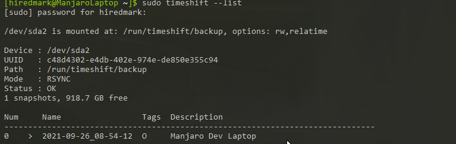
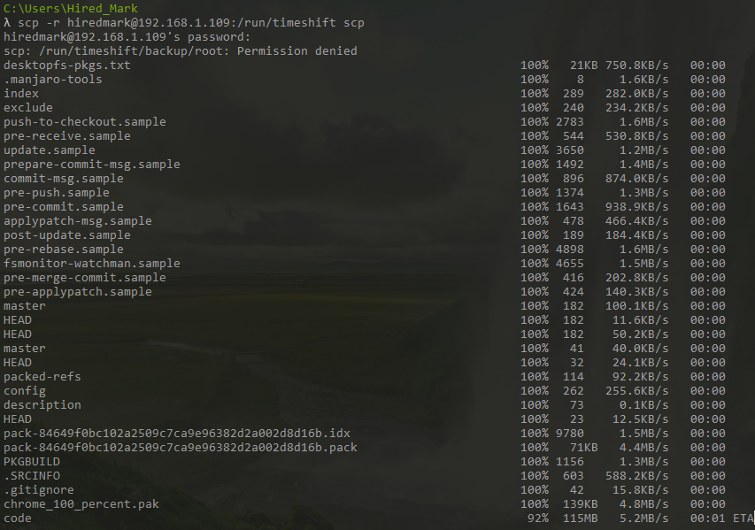
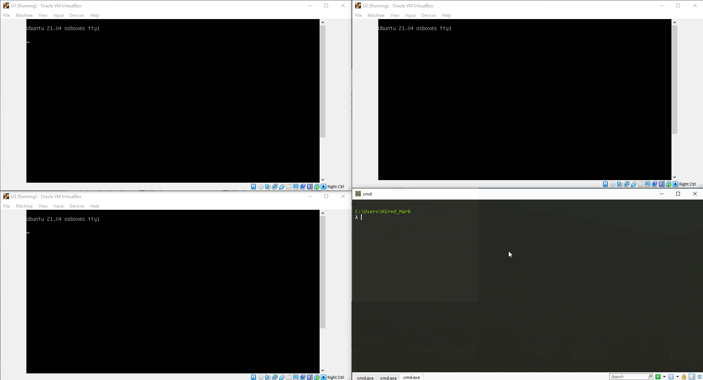

# HomeLab-Part-1

This a sort of a work and training journal, that encompases the creation of a little server of my own, for my own testing and training.

Ok here is the initial plan. I have an oldie laptop. It is not special but it is mine. So it is not doing much at the moment. I would like to use it for work but unfortunately I don't think it is very comfortable for me to use (Tall people problems). However I need to be able to return it to working condition pretty quick. So here is the plan:

1. Take the laptop and snapshot it to an USB - that way I have a working back up to return to.

2. Erase its internal SSD. Install Proxmox.

3. Spin up a VM using Terraform.

4. Use Ansible as a configuration manager to ensure the image on there is good.

5. Have a Dev VM I can SSH into.

6. Have a series of containers for Docker and Kubernates labs in the future.

Things to include - notes from the learning process.

# Step 1 - Back up Laptop

1. SHH into laptop and run timesift - (Note Manjaro doesn't normally come with it.)



2. SCP files back to myself over SSH and back them up in this GIT repository. It contains no user files but I would like it to save my configuration so I can easily return to it.

Usage:

```
scp -r [USER]@[IP]:[SOURCE] [DESTINATION]
```



Things I have discovered - Github doesn't like large files. So I will be backing up the image ot Google Drive instead.

# Step 2 - Get Proxmox on there!

## Getting Started with Proxmox

- Download Proxmox VE ISO - https://www.proxmox.com/en/downloads
- Download Rufus - https://rufus.ie/en/
- Delete partition tables from USB stick.
- Flash Proxmox onto a USB stick and then boot from it.
- Get ethernet cable and plug it in since proxmox doesn't support wifi easily especially without initial internet connection.

# Step 4 - Spin up servers with Terraform

# Step 5 - Configure things wih Ansible

I am actually going to start practicing Ansible, whilst I wait for a suitable cale to arrive / get my hand in a working enough order to deal with hardware.

## Practice run!

### 1. Set up VMs to administer.

- Downloaded Lubuntu images - https://www.linuxvmimages.com/images/lubuntu-2104
- Updated machine and installed OpenSSH
- set VirtualBox adaptor to bridged to allow IPs to be unique.

Tadaaaaaaaaaaaa

