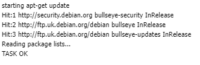

# HomeLab-Part-1

This a sort of a work and training journal, that encompases the creation of a little server of my own, for my own testing and training.

Ok here is the initial plan. I have an oldie laptop. It is not special but it is mine. So it is not doing much at the moment. I would like to use it for work but unfortunately I don't think it is very comfortable for me to use (Tall people problems). However I need to be able to return it to working condition pretty quick. So here is the plan:

1. Take the laptop and snapshot it to an USB - that way I have a working back up to return to.

2. Erase its internal SSD. Install Proxmox.

3. Spin up a VM using Terraform.

4. Use Ansible as a configuration manager to ensure the image on there is good.

5. Have a Dev VM I can SSH into.

6. Have a series of containers for Docker and Kubernates labs in the future.

Things to include - notes from the learning process.

# Step 1 - Back up Laptop

1. SHH into laptop and run timesift - (Note Manjaro doesn't normally come with it.)


2. SCP files back to myself over SSH and back them up in this GIT repository. It contains no user files but I would like it to save my configuration so I can easily return to it.

Usage:

```
scp -r [USER]@[IP]:[SOURCE] [DESTINATION]
```


Things I have discovered - Github doesn't like large files. So I will be backing up the image ot Google Drive instead.

# Step 2 - Get Proxmox on there!

## Getting Started with Proxmox

- Download Proxmox VE ISO - https://www.proxmox.com/en/downloads
- Download Rufus - https://rufus.ie/en/
- Delete partition tables from USB stick.
- Flash Proxmox onto a USB stick and then boot from it.
- Get ethernet cable and plug it in since proxmox doesn't support wifi easily especially without initial internet connection.

## Connection and Initial SetUp

- After install https into the IP you set in installation at port 8006
- Once logged in you can see the main interface.


- Be sure to update the server. In this case I disabled the proxmox repositories and just use the debian ones.



- Upload Ubuntu server 21.04 image

  

- Create a VM and ssh into it.

  

- Install QEMU agent and apache2

  

## Create template for later use

### CleanUp

We are going to use cloud-init's features to ensure the machine is unique in every instance.

- Remove SSH keys.


- Remove machineid and make sure its other reference is just a link.


- Clean repos and unnecessary packages.


- Unplug ISO image drive


### Configure and create

- Create cloudinit drive.


- Adjust settings.


- Create template.


- Clone future instances from template.


## For posterity from now on

I would like to use Kubernates to manage my containers. But I want to explore the rest of the featureset of Proxmox whilst I am here.

## Containers in ProxMox

Containers in ProxMox cannot be managed by Kubernates. That is because they are LXC containers. ProxMox uses LXD to manange them.
There are a few advantages to them:

- Closer to VMs, LXC containers can be used to just have a more efficient VM infrastructure.
- They share CPU resources
- They are automatically persistent unlike normal containers

The dissadvantages however are three main ones:

- Cannot be orchestrated by any other tools.
- Cannot automatically SSH into them.
- They don't have Cloud Init to help set them up.

# Step 4 - Spin up servers with Terraform

## Setup

My controller is a Windows Machine I use to teach so I have Linux Subsystem for Windows installed.


Curiously you can install things by default in the linux subsystem. Terraform has its own Hashicorp repos. So the usual rigamorole of install and authenticate repos then use apt package manager to install.


Terraform needs an API to talk to. To do so securely it needs API Keys and a user that can do what is needed.


I have named this account Terraform so I can track it in proxmox logs. I can see the actions is it takes. Here is the API token it needs to talk to proxmox server.


Keep note of these details you will need them in the Terraform files. For security reasons it is better to have them set as ENV variables but for the sake of testing functionality I have skipped this step so I can turn the controller on and off in case of issues.


Giving root access to the terraform account for creation of VMs anywhere in the Proxmox Datacentre in case there is more than one node attached.


Giving admin rights over the drive in order to allow cloud-init to talk and initialise.


I have created a temporary working directory so I can work in the Linux Subsystem for Windows. This is then cleaned when I upload it to git. This is one of the methods I use to protect the keys I have for this test. The keys themselves are already deleted but it builds good practice.


The main string that selects the provider. It is important that this is there. This gets terraform to iniintialise by getting the plug in from Telmate and installing it on the controller machine.


Hey look it is a successful installation! :D


## Test Apply

Ok so now a basic script is in to try and launch a test server based on an existing template that we originally created earlier.


Ah this is more like it. Here we have a few issues to work through. Initially noticed it was failing. Turning Terraform log on revealed that I had mistyped the API token ID.


This one I wasn't expecting. Apparently the proxmox template drive configuration takes priority over Terraform. Judging by the fact integration between the two seems to be patchy though it makes sense. I guess make templates small and then scale up from there since downsizing them with Terraform doesn't work.


Another error that I was not expecting is that the boot drive failed to initialise. This caused a boot loop in the test VM. Deleting the VM and restarting Terraform was an adequate solution.


Yay it works, so let's do it properly.


## Real infrastructure

So I have 4 CPUs on my laptop so I need to be sparse. That makes things a bit difficult . So let's look at what we will do.

3 VMs total, so easy interactions -

1. Kubernates Manager node
2. Kubernates Worker node
3. Kubernates Storage node - so that we can persist the information in the cluster.


And this is why we like Terraform. Scaling things up and down is soooooooo easy!


# Step 5 - Configure things wih Ansible

I am actually going to start practicing Ansible, whilst I wait for a suitable cale to arrive / get my hand in a working enough order to deal with hardware.

## Practice run!

### 1. Set up VMs to administer.

- Downloaded Lubuntu images - https://www.linuxvmimages.com/images/lubuntu-2104
- Updated machine and installed OpenSSH
- set VirtualBox adaptor to bridged to allow IPs to be unique.

Tadaaaaaaaaaaaa


- the Workstation VM is the master.
- install openssh-server on all themachines
- set up SSH keys between master and cluster machines.
- use ssh-keygen and ssh-copy-id to set it all up.

### 2. Have your cable arrive and then move onto the real thing.

Never mind learnt a lot about VM bridging.
